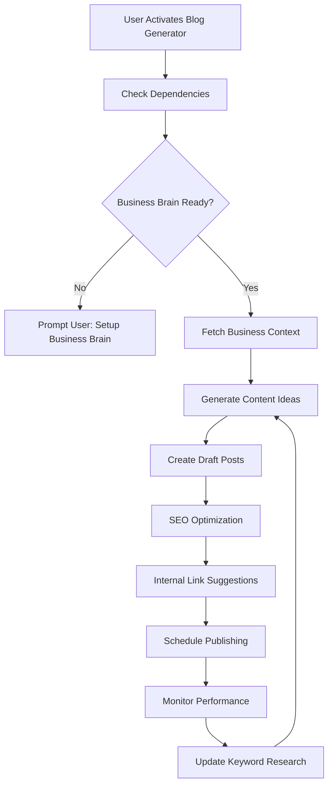
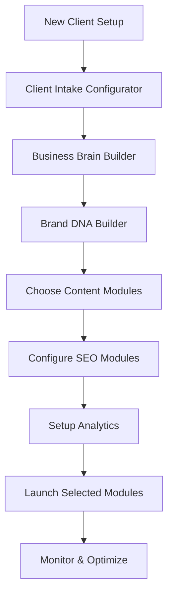
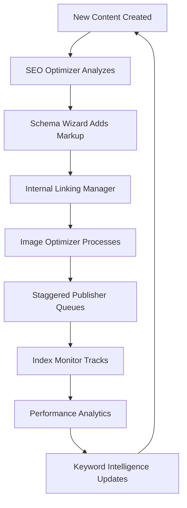

# Integration Patterns Architecture

## 🔄 Module Integration Philosophy

The Disruptors Site Modules system is designed around **intelligent integration** - modules work better together than alone, while maintaining independence and avoiding tight coupling. Each integration follows established patterns that ensure reliability, maintainability, and user transparency.

## 🧩 Integration Categories

### 1. Foundation → Dependent Pattern

**Concept**: Core modules provide foundational data that dependent modules consume.

**Example Flow**:
```
Business Brain Builder → Brand DNA Builder → Content Generation Modules
```

**Implementation**:
- Foundation modules expose standardized data APIs
- Dependent modules declare foundation requirements in their schema
- System validates dependencies before module activation
- Data flows automatically without user intervention

**User Experience**:
- Setup wizard warns if dependencies aren't configured
- Automatic setup suggestions ("Configure Business Brain first")
- Clear dependency visualization in module cards

### 2. Sequential Processing Pattern

**Concept**: Output from one module becomes input for the next in a processing chain.

**Example Flow**:
```
Keyword Intelligence → Blog Generator → SEO Optimizer → Staggered Publisher
```

**Implementation**:
```javascript
// Sequential processing example
keywordIntelligence.onComplete((keywords) => {
  blogGenerator.addKeywords(keywords);
});

blogGenerator.onPublish((post) => {
  seoOptimizer.analyzePage(post.url);
  staggeredPublisher.scheduleNext(post);
});
```

**User Experience**:
- Visual flow diagram showing content journey
- Status updates at each stage
- Easy troubleshooting when chain breaks

### 3. Parallel Enhancement Pattern

**Concept**: Multiple modules operate on the same content simultaneously to enhance it from different angles.

**Example Flow**:
```
New Blog Post Created
├── SEO Optimizer (adds meta tags, schema)
├── Internal Linking Manager (adds relevant links)
├── Image Optimizer (optimizes featured image)
└── Social Sharing (creates social posts)
```

**Implementation**:
```javascript
// Parallel enhancement
const enhanceContent = async (contentId) => {
  const enhancements = await Promise.allSettled([
    seoOptimizer.enhance(contentId),
    linkingManager.addLinks(contentId),
    imageOptimizer.optimize(contentId),
    socialSharing.createPosts(contentId)
  ]);
  
  return combineEnhancements(enhancements);
};
```

### 4. Data Aggregation Pattern

**Concept**: Multiple modules contribute data to a central aggregator that provides comprehensive insights.

**Example Flow**:
```
SEO Optimizer ─┐
Blog Generator ─┤→ Analytics Hub → Performance Reports
CTA Optimizer ─┘
```

**Implementation**:
- Standardized metrics format across all modules
- Central data warehouse for cross-module analysis
- Configurable dashboards and reports

## 🛠️ Technical Integration Methods

### API-Based Integration

**RESTful Module APIs**:
```javascript
// Standard module API pattern
class ModuleAPI {
  async getData(moduleId, dataType, filters = {}) {
    return await fetch(`/api/modules/${moduleId}/data/${dataType}`, {
      method: 'POST',
      headers: { 'Content-Type': 'application/json' },
      body: JSON.stringify({ filters })
    }).then(res => res.json());
  }
  
  async triggerAction(moduleId, action, payload = {}) {
    return await fetch(`/api/modules/${moduleId}/actions/${action}`, {
      method: 'POST',
      headers: { 'Content-Type': 'application/json' },
      body: JSON.stringify(payload)
    }).then(res => res.json());
  }
}

// Usage example
const businessData = await moduleAPI.getData('business-brain-builder', 'profile');
const contentResult = await moduleAPI.triggerAction('blog-generator', 'create-post', {
  keywords: ['AI automation'],
  businessContext: businessData
});
```

### Event-Driven Integration

**Publish-Subscribe Event System**:
```javascript
// Event definitions
const ModuleEvents = {
  CONTENT_CREATED: 'content.created',
  CONTENT_UPDATED: 'content.updated',
  CONTENT_PUBLISHED: 'content.published',
  SEO_ANALYZED: 'seo.analyzed',
  KEYWORDS_UPDATED: 'keywords.updated',
  USER_CONFIG_CHANGED: 'config.changed'
};

// Publisher example
blogGenerator.createPost(postData).then(post => {
  EventBus.publish(ModuleEvents.CONTENT_CREATED, {
    moduleId: 'blog-generator',
    contentType: 'blog-post',
    contentId: post.id,
    metadata: {
      keywords: post.keywords,
      publishDate: post.scheduledDate,
      wordCount: post.content.length
    }
  });
});

// Subscriber example
EventBus.subscribe(ModuleEvents.CONTENT_CREATED, async (event) => {
  if (event.data.contentType === 'blog-post') {
    // SEO Optimizer responds to new content
    await seoOptimizer.analyzePage(event.data.contentId);
    
    // Internal Linking Manager adds relevant links
    await linkingManager.suggestLinks(event.data.contentId);
    
    // Schedule for publishing
    await staggeredPublisher.addToQueue(event.data.contentId, event.data.metadata.publishDate);
  }
});
```

### Shared Data Storage Integration

**Common Data Store Pattern**:
```javascript
// Shared data schema
const SharedDataSchema = {
  businessProfile: {
    module: 'business-brain-builder',
    fields: ['companyName', 'industry', 'targetAudience', 'keyServices'],
    permissions: {
      read: ['blog-generator', 'landing-page-builder', 'cta-orchestrator'],
      write: ['business-brain-builder'],
      expire: '30d'
    }
  },
  brandGuidelines: {
    module: 'brand-dna-builder',
    fields: ['voiceTone', 'colorPalette', 'writingStyle'],
    permissions: {
      read: ['all-content-modules'],
      write: ['brand-dna-builder']
    }
  },
  keywordResearch: {
    module: 'keyword-intelligence',
    fields: ['primaryKeywords', 'longTails', 'competitors'],
    permissions: {
      read: ['blog-generator', 'landing-page-builder', 'seo-optimizer'],
      write: ['keyword-intelligence']
    }
  }
};

// Access pattern
const getSharedData = async (dataType, requestingModule) => {
  const schema = SharedDataSchema[dataType];
  
  if (!schema.permissions.read.includes(requestingModule)) {
    throw new Error('Insufficient permissions');
  }
  
  return await dataStore.get(dataType, schema.fields);
};
```

## 🔗 Common Integration Workflows

### Content Creation Workflow



### Client Onboarding Workflow



### SEO Optimization Workflow



## 📊 Data Flow Standards

### Standard Data Formats

**Business Profile Format**:
```json
{
  "moduleId": "business-brain-builder",
  "version": "1.0",
  "timestamp": "2024-01-01T12:00:00Z",
  "data": {
    "companyName": "Tech Innovators Inc",
    "industry": "Technology",
    "description": "AI consulting and digital transformation",
    "targetAudience": [
      {
        "segment": "CTOs",
        "painPoints": ["legacy systems", "digital transformation"],
        "goals": ["modernization", "efficiency"]
      }
    ],
    "keyServices": [
      {"name": "AI Consulting", "category": "consulting"},
      {"name": "Digital Transformation", "category": "implementation"}
    ],
    "competitorAnalysis": {
      "directCompetitors": ["CompanyA", "CompanyB"],
      "keywordGaps": ["AI strategy", "digital roadmap"]
    }
  }
}
```

**Content Metadata Format**:
```json
{
  "contentId": "post-123",
  "contentType": "blog-post",
  "title": "AI Automation Guide for CTOs",
  "slug": "ai-automation-guide-ctos",
  "status": "draft",
  "metadata": {
    "primaryKeyword": "AI automation",
    "targetKeywords": ["digital transformation", "AI strategy"],
    "readingTime": 8,
    "wordCount": 1250,
    "seoScore": 85,
    "targetAudience": "CTOs"
  },
  "integrations": {
    "seoOptimized": true,
    "internalLinksAdded": true,
    "imageOptimized": true,
    "socialPostsCreated": false
  }
}
```

## 🔧 Configuration Integration

### Cross-Module Settings

Some settings affect multiple modules and require coordination:

```javascript
// Global settings that affect multiple modules
const globalConfig = {
  brandVoice: {
    tone: "professional-authoritative",
    affectedModules: ["blog-generator", "landing-page-builder", "email-automation"]
  },
  targetAudience: {
    primary: "CTOs",
    secondary: ["Tech Managers", "IT Directors"],
    affectedModules: ["keyword-intelligence", "content-generation", "cta-orchestrator"]
  },
  contentSchedule: {
    frequency: "3-posts-per-week",
    days: ["monday", "wednesday", "friday"],
    affectedModules: ["blog-generator", "editorial-calendar", "staggered-publisher"]
  }
};

// Update propagation system
const updateGlobalSetting = async (settingKey, newValue) => {
  const setting = globalConfig[settingKey];
  globalConfig[settingKey].value = newValue;
  
  // Notify affected modules
  for (const moduleId of setting.affectedModules) {
    await notifyModuleOfSettingChange(moduleId, settingKey, newValue);
  }
  
  // Log the change
  logConfigurationChange(settingKey, newValue, setting.affectedModules);
};
```

## 🚨 Error Handling in Integrations

### Graceful Degradation

When integration dependencies fail, modules should gracefully degrade:

```javascript
const createBlogPost = async (keywords) => {
  let businessContext = null;
  let brandGuidelines = null;
  
  try {
    // Attempt to get business context
    businessContext = await getSharedData('businessProfile', 'blog-generator');
  } catch (error) {
    console.warn('Business context unavailable, using defaults');
    businessContext = getDefaultBusinessContext();
  }
  
  try {
    // Attempt to get brand guidelines
    brandGuidelines = await getSharedData('brandGuidelines', 'blog-generator');
  } catch (error) {
    console.warn('Brand guidelines unavailable, using neutral tone');
    brandGuidelines = getDefaultBrandGuidelines();
  }
  
  // Create post with available context
  return await generatePost({
    keywords,
    context: businessContext,
    brand: brandGuidelines
  });
};
```

### Integration Health Monitoring

```javascript
const checkIntegrationHealth = async () => {
  const integrationStatus = {};
  
  for (const [moduleId, module] of Object.entries(activeModules)) {
    integrationStatus[moduleId] = {
      dependencies: await checkDependencies(module.dependencies),
      dataAccess: await testDataAccess(moduleId),
      eventSubscriptions: await verifyEventSubscriptions(moduleId),
      externalAPIs: await pingExternalServices(module.externalServices)
    };
  }
  
  return integrationStatus;
};
```

## 📈 Performance Optimization

### Lazy Loading Integration

```javascript
// Load integration dependencies only when needed
const lazyLoadIntegration = async (sourceModule, targetModule, operationType) => {
  const integrationKey = `${sourceModule}-${targetModule}-${operationType}`;
  
  if (!integrationCache.has(integrationKey)) {
    const integration = await loadIntegration(sourceModule, targetModule);
    integrationCache.set(integrationKey, integration);
  }
  
  return integrationCache.get(integrationKey);
};
```

### Batch Processing

```javascript
// Batch related operations for efficiency
const batchIntegrationOperations = async (operations) => {
  const batches = groupOperationsByTarget(operations);
  const results = [];
  
  for (const [targetModule, ops] of batches) {
    const batchResult = await processBatch(targetModule, ops);
    results.push(...batchResult);
  }
  
  return results;
};
```

This integration architecture ensures that modules work together seamlessly while maintaining independence, reliability, and user-friendly operation.