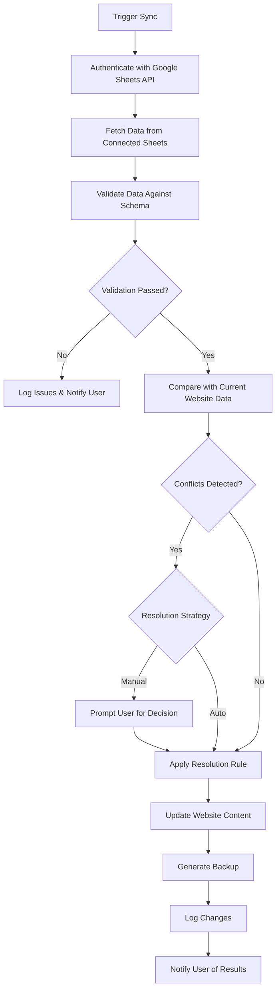

# Sheets Sync Module

## 🎯 Purpose

The Sheets Sync Module transforms Google Sheets into a lightweight database solution for website content management. It allows non-technical users to manage parts of the website (lists, pages, prices, FAQs, resources, blog pipelines, etc.) from familiar Google Sheets interface while keeping selected sheets automatically synchronized with the site.

## 📋 Module Overview

**Category**: Automation  
**Complexity**: Medium  
**Dependencies**: Google Sheets API  
**User Level**: All users (designed for non-technical)

### What It Does

- **Database Alternative**: Use Google Sheets as a simple, familiar content management system
- **Automatic Synchronization**: Keep website content in sync with sheet changes
- **Multiple Data Sources**: Connect several sheets/tabs to different parts of the site
- **Real-Time Updates**: Changes in sheets reflect on the website automatically
- **Conflict Management**: Handle simultaneous edits gracefully
- **Data Validation**: Ensure content meets website requirements before publishing

## 🧙‍♂️ User Experience

### Dashboard Card Display

```
┌─────────────────────────────────┐
│ ┌─────┐               [●]       │
│ │ 📊  │  Sheets Sync            │
│ └─────┘                         │
│                                 │
│ Simple way to use Google        │
│ Sheets like a database for      │
│ your site content.              │
│                                 │
│ ┌─────────────┐ ┌─────────────┐ │
│ │  Configure  │ │   Active    │ │
│ └─────────────┘ └─────────────┘ │
│                                 │
│ 3 sheets connected              │
│ Last sync: 15 minutes ago       │
└─────────────────────────────────┘
```

### Onboarding Wizard Flow

**Step 1: Welcome & Overview**
- Explanation of how Sheets Sync works
- Benefits: familiar interface, real-time updates, team collaboration
- Examples of what can be managed (blog posts, FAQ items, team members)

**Step 2: Connect Your Sheets**
- Paste Google Sheets links or select from authorized sheets
- Option to create new sheets from templates
- Multiple sheet support with clear naming

**Step 3: Configure Data Mapping**
- Visual column mapping interface
- Drag-and-drop field assignment
- Data type validation (text, URL, date, number)
- Preview of how data will appear on site

**Step 4: Set Sync Preferences**
- Sync frequency (manual, hourly, daily, real-time)
- Conflict resolution preferences
- Notification settings for sync events

**Step 5: Review & Launch**
- Preview of data to be imported
- Validation results with any warnings
- Final confirmation and activation

## ⚙️ Technical Configuration

### Configuration Schema

```json
{
  "moduleId": "sheets-sync",
  "displayName": "Sheets Sync",
  "category": "automation",
  "configurationFields": [
    {
      "id": "connected_sheets",
      "type": "array",
      "label": "Connected Google Sheets",
      "description": "Add multiple sheets to sync with your website",
      "required": true,
      "itemSchema": {
        "sheet_url": {
          "type": "url",
          "label": "Sheet URL",
          "validation": {
            "pattern": "https://docs.google.com/spreadsheets/",
            "errorMessage": "Must be a valid Google Sheets URL"
          }
        },
        "sheet_name": {
          "type": "text",
          "label": "Sheet Name",
          "description": "Friendly name for this sheet"
        },
        "tab_name": {
          "type": "text", 
          "label": "Tab Name",
          "default": "Sheet1"
        },
        "data_range": {
          "type": "text",
          "label": "Data Range",
          "default": "A1:Z1000",
          "description": "Cell range to sync (e.g., A1:K100)"
        }
      }
    },
    {
      "id": "column_mappings",
      "type": "object",
      "label": "Column Mappings",
      "description": "Map sheet columns to website fields",
      "required": true
    },
    {
      "id": "sync_settings",
      "type": "object",
      "label": "Sync Settings",
      "fields": [
        {
          "id": "frequency",
          "type": "select",
          "label": "Sync Frequency",
          "options": [
            {"value": "manual", "label": "Manual - Only when I trigger"},
            {"value": "hourly", "label": "Every Hour"},
            {"value": "daily", "label": "Daily at 6 AM"},
            {"value": "realtime", "label": "Real-time (uses quotas faster)"}
          ],
          "default": "daily"
        },
        {
          "id": "conflict_resolution",
          "type": "select",
          "label": "When Sheet and Website Conflict",
          "options": [
            {"value": "sheet_wins", "label": "Sheet data overwrites website"},
            {"value": "website_wins", "label": "Keep website data unchanged"},
            {"value": "manual_review", "label": "Ask me to decide each time"}
          ],
          "default": "sheet_wins"
        },
        {
          "id": "validate_before_sync",
          "type": "boolean",
          "label": "Validate Data Before Syncing",
          "default": true,
          "description": "Check for missing required fields and invalid formats"
        }
      ]
    },
    {
      "id": "notification_preferences",
      "type": "object",
      "label": "Notifications",
      "fields": [
        {
          "id": "sync_success_notify",
          "type": "boolean",
          "label": "Notify on Successful Sync",
          "default": false
        },
        {
          "id": "sync_error_notify", 
          "type": "boolean",
          "label": "Notify on Sync Errors",
          "default": true
        },
        {
          "id": "validation_issues_notify",
          "type": "boolean",
          "label": "Notify About Data Issues",
          "default": true
        }
      ]
    }
  ]
}
```

### Data Mapping Interface

The column mapping system allows flexible field assignment:

```javascript
// Example mapping configuration
const columnMapping = {
  "Blog Posts Sheet": {
    "A": { field: "title", type: "text", required: true },
    "B": { field: "slug", type: "slug", required: true },
    "C": { field: "content", type: "markdown", required: true },
    "D": { field: "author", type: "text", required: false },
    "E": { field: "publish_date", type: "date", required: true },
    "F": { field: "featured_image_url", type: "url", required: false },
    "G": { field: "meta_description", type: "text", maxLength: 160 },
    "H": { field: "keywords", type: "tags", required: false },
    "I": { field: "status", type: "select", options: ["draft", "published", "archived"] }
  },
  "FAQ Sheet": {
    "A": { field: "question", type: "text", required: true },
    "B": { field: "answer", type: "markdown", required: true },
    "C": { field: "category", type: "text", required: false },
    "D": { field: "order", type: "number", required: false }
  }
};
```

## 🔄 Core Functionality

### Sync Process Architecture



### Data Validation System

```javascript
// Validation engine
const validateSheetData = (sheetData, mapping) => {
  const issues = [];
  const validatedData = [];
  
  sheetData.forEach((row, index) => {
    const rowNumber = index + 2; // +2 for header row and 0-based index
    const validatedRow = {};
    let rowValid = true;
    
    // Validate each mapped column
    Object.entries(mapping).forEach(([column, config]) => {
      const value = row[column];
      const fieldValidation = validateField(value, config);
      
      if (!fieldValidation.valid) {
        issues.push({
          row: rowNumber,
          column: column,
          field: config.field,
          issue: fieldValidation.error,
          severity: config.required ? 'error' : 'warning'
        });
        rowValid = false;
      } else {
        validatedRow[config.field] = fieldValidation.processedValue;
      }
    });
    
    if (rowValid) {
      validatedData.push(validatedRow);
    }
  });
  
  return {
    validData: validatedData,
    issues: issues,
    summary: {
      totalRows: sheetData.length,
      validRows: validatedData.length,
      errorCount: issues.filter(i => i.severity === 'error').length,
      warningCount: issues.filter(i => i.severity === 'warning').length
    }
  };
};

const validateField = (value, config) => {
  // Required field validation
  if (config.required && (!value || value.trim() === '')) {
    return { valid: false, error: `${config.field} is required` };
  }
  
  // Skip validation for empty optional fields
  if (!value || value.trim() === '') {
    return { valid: true, processedValue: null };
  }
  
  // Type-specific validation
  switch (config.type) {
    case 'url':
      if (!value.match(/^https?:\/\/.+/)) {
        return { valid: false, error: 'Invalid URL format' };
      }
      break;
      
    case 'email':
      if (!value.match(/\S+@\S+\.\S+/)) {
        return { valid: false, error: 'Invalid email format' };
      }
      break;
      
    case 'date':
      if (isNaN(Date.parse(value))) {
        return { valid: false, error: 'Invalid date format' };
      }
      break;
      
    case 'slug':
      if (!value.match(/^[a-z0-9-]+$/)) {
        return { valid: false, error: 'Slug must be lowercase letters, numbers, and dashes only' };
      }
      break;
  }
  
  // Length validation
  if (config.maxLength && value.length > config.maxLength) {
    return { valid: false, error: `Must be ${config.maxLength} characters or less` };
  }
  
  return { valid: true, processedValue: value };
};
```

## 📊 Status & Monitoring

### Real-Time Status Display

```javascript
// Status information shown to users
const getModuleStatus = () => {
  return {
    overall_status: 'active', // active, error, syncing, paused
    connected_sheets: [
      {
        name: 'Blog Posts',
        url: 'https://docs.google.com/spreadsheets/d/abc123',
        last_sync: '2024-01-15T10:30:00Z',
        status: 'healthy',
        row_count: 45,
        issues_count: 0
      },
      {
        name: 'FAQ Items', 
        url: 'https://docs.google.com/spreadsheets/d/def456',
        last_sync: '2024-01-15T10:25:00Z',
        status: 'warnings',
        row_count: 12,
        issues_count: 2
      }
    ],
    sync_history: [
      {
        timestamp: '2024-01-15T10:30:00Z',
        result: 'success',
        changes: { added: 3, updated: 1, deleted: 0 },
        duration_ms: 2500
      }
    ],
    next_scheduled_sync: '2024-01-16T06:00:00Z',
    performance_metrics: {
      average_sync_duration: 2100,
      success_rate: 0.97,
      total_syncs_this_month: 45
    }
  };
};
```

### User-Friendly Status Messages

- **Active & Healthy**: "✅ 3 sheets connected, last sync 15 minutes ago"
- **Syncing**: "⏳ Syncing data from Blog Posts sheet..."  
- **Issues Found**: "⚠️ 2 warnings in FAQ sheet - review needed"
- **Sync Failed**: "❌ Unable to connect to Google Sheets - check permissions"
- **Manual Action Required**: "👤 5 conflicts need your decision"

## 🛡️ Error Handling & Recovery

### Common Error Scenarios

**Permission Errors**
- Clear instructions for sharing sheet with service account
- Step-by-step permission troubleshooting guide
- Auto-retry with exponential backoff

**API Quota Exceeded**
- Automatic pause until quota resets
- User notification with expected resume time
- Suggestions for reducing API usage

**Data Validation Failures**
- Detailed issue reports with row/column references
- Suggestions for fixing common problems
- Option to sync valid rows while flagging issues

**Sheet Structure Changes**
- Detection of column additions/removals
- Guided remapping wizard
- Backup of previous mapping configuration

### Recovery Procedures

```javascript
// Automatic recovery strategies
const handleSyncError = async (error, context) => {
  switch (error.type) {
    case 'PERMISSION_DENIED':
      // Pause sync and guide user through permission fix
      await pauseModule();
      await notifyUser('permission_issue', {
        sheet: context.sheetName,
        instructions: generatePermissionInstructions(context.sheetId)
      });
      break;
      
    case 'QUOTA_EXCEEDED':
      // Schedule retry after quota reset
      const resetTime = await getQuotaResetTime();
      await scheduleRetry(resetTime);
      await notifyUser('quota_exceeded', { resumeTime: resetTime });
      break;
      
    case 'VALIDATION_FAILED':
      // Sync valid data, report issues
      const validData = extractValidData(context.data);
      if (validData.length > 0) {
        await syncData(validData);
      }
      await generateValidationReport(context.issues);
      break;
      
    case 'NETWORK_ERROR':
      // Exponential backoff retry
      await retryWithBackoff(() => performSync(), {
        maxRetries: 3,
        baseDelay: 1000
      });
      break;
  }
};
```

## 🔌 Integration Points

### Modules That Use Sheets Sync

**Blog Generator Module**
- Syncs with Blog Posts sheet for content pipeline
- Reads keyword lists and publishing schedules
- Updates sheet with generated content status

**Clients Library Module**
- Syncs client information from master client sheet
- Updates testimonials and project status
- Maintains portfolio links and case study data

**Editorial Calendar Module**
- Pulls publishing schedules from content calendar sheet
- Updates with actual publish dates and performance metrics

**FAQ Management**
- Syncs frequently asked questions from FAQ sheet
- Maintains categories and display order

### Data Export Capabilities

- **CSV Export**: Download current synced data
- **Sheet Templates**: Generate new sheets with proper column structure  
- **Backup Creation**: Automatic snapshots before major changes
- **Change Logs**: Detailed history of what changed when

## 📈 Performance & Optimization

### Optimization Strategies

**Intelligent Caching**
- Cache unchanged rows to minimize API calls
- Track last-modified timestamps per row
- Implement smart change detection

**Batch Processing**
- Group multiple sheet updates into single API calls
- Process changes in optimal order (creates before updates)
- Implement change queuing for high-frequency updates

**Efficient Polling**
- Use Google Sheets API change notifications where available
- Implement exponential backoff for polling frequency
- Skip sync when no changes detected

### Performance Metrics

- **Sync Duration**: Target < 30 seconds for typical datasets
- **API Efficiency**: < 10 API calls per 100 rows of data
- **Change Detection**: Identify actual changes vs. cosmetic edits
- **User Experience**: Show progress for syncs > 10 seconds

## 🎯 Success Metrics

### User Experience Metrics
- **Time to First Sync**: < 10 minutes from activation
- **Setup Success Rate**: > 90% complete wizard without issues
- **User Satisfaction**: Easy data management without technical knowledge

### Technical Performance Metrics
- **Sync Reliability**: > 99% successful sync operations
- **Data Accuracy**: Zero data corruption or loss incidents
- **API Efficiency**: Optimal use of Google Sheets API quotas

### Business Impact Metrics
- **Content Update Frequency**: Increase in how often content is updated
- **Team Collaboration**: Multiple people managing website content
- **Operational Efficiency**: Reduced time spent on manual content updates

This module transforms Google Sheets from a simple spreadsheet tool into a powerful, user-friendly content management system that non-technical team members can use to keep website content fresh and accurate.