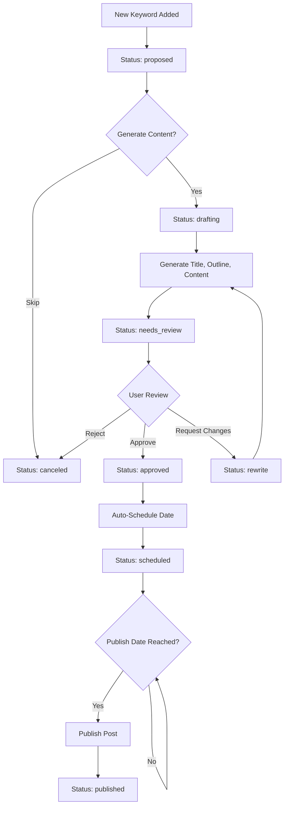

# Blog Generator Module

## 🎯 Purpose

The Blog Generator Module transforms keyword research into fully formatted, brand-consistent blog posts through an automated content creation and publishing workflow. It manages the entire process through a Google Sheet interface, allowing easy review, approval, and scheduling of AI-generated content.

## 📋 Module Overview

**Category**: Content Generation  
**Complexity**: High  
**Dependencies**: Sheets Sync, Business Brain Builder (required), Brand DNA Builder (recommended)  
**User Level**: Content managers, marketers

### What It Does

- **Automated Content Creation**: Generates complete blog posts from approved keywords
- **Sheet-Based Management**: Manages entire workflow through familiar Google Sheets interface
- **Brand Consistency**: Uses Business Brain and Brand DNA for consistent voice and messaging
- **Intelligent Scheduling**: Automatically spaces posts for optimal publishing cadence
- **Image Integration**: Generates featured images with prompts and CDN links
- **SEO Optimization**: Creates content optimized for target keywords and search intent
- **Review Workflow**: Easy approval process with rewrite options

## 🧙‍♂️ User Experience

### Dashboard Card Display

```
┌─────────────────────────────────┐
│ ┌─────┐               [●]       │
│ │ ✏️   │  Blog Generator         │
│ └─────┘                         │
│                                 │
│ Automated blog post creation    │
│ and publishing from your        │
│ approved keywords.              │
│                                 │
│ ┌─────────────┐ ┌─────────────┐ │
│ │ View Posts  │ │  Settings   │ │
│ └─────────────┘ └─────────────┘ │
│                                 │
│ 7 drafts awaiting approval      │
│ Next post: Tomorrow at 9 AM     │
└─────────────────────────────────┘
```

### Onboarding Wizard Flow

**Step 1: Welcome & Purpose**
- Explanation of automated blog creation process
- Benefits: consistent publishing, SEO optimization, brand voice
- Preview of the complete workflow from keyword to published post

**Step 2: Connect Blog Management Sheet**
- Link existing Google Sheet or create new one from template
- Template includes all necessary columns and formulas
- Preview of sample data and workflow

**Step 3: Choose Writing Style**
- Select from Brand DNA options if available
- Choose author persona for bylines
- Set tone preferences (professional, casual, bold, technical)
- Live preview of writing style with sample text

**Step 4: Configure Publishing Schedule**
- Set days between posts (default: 2 days)
- Choose maximum posts per week
- Set preferred publishing times
- Calendar preview of upcoming schedule

**Step 5: Image & Asset Settings**
- Enable automatic featured image generation
- Set image style preferences
- Configure internal linking preferences
- SEO optimization settings

**Step 6: Review & Launch**
- Preview of complete configuration
- Test run with sample keyword
- Connect to keyword sources
- Activate automated workflow

## ⚙️ Blog Posts Sheet Structure

### Complete Column Schema

The Google Sheet that manages the blog pipeline includes these columns:

| Column | Field Name | Type | Description | Required |
|--------|------------|------|-------------|----------|
| A | keyword | Text | Primary keyword for the post | Yes |
| B | search_intent | Select | informational/commercial/navigational/transactional | Auto-filled |
| C | proposed_title | Text | AI-generated title suggestion | Auto-generated |
| D | outline | Multi-line | Post outline with H2/H3 structure | Auto-generated |
| E | draft_body | Rich Text | Full post content in markdown | Auto-generated |
| F | featured_image_prompt | Text | Prompt for image generation | Auto-generated |
| G | featured_image_url | URL | Link to generated/uploaded image | Auto-filled |
| H | author_persona | Dropdown | Selected author for byline | User selects |
| I | tone | Dropdown | professional/casual/bold/technical | User selects |
| J | status | Dropdown | proposed/drafting/needs_review/approved/rewrite/canceled/scheduled/published | User controls |
| K | notes | Text | Editor notes and revision requests | User input |
| L | scheduled_date | Date | Auto-suggested publication date | Auto-generated |
| M | url_slug | Text | SEO-friendly URL slug | Auto-generated |
| N | internal_links | Multi-line | Suggested internal links to include | Auto-generated |
| O | meta_description | Text | SEO meta description (155 chars) | Auto-generated |
| P | schema_type | Select | Article/FAQArticle/HowTo | Auto-generated |
| Q | word_count_target | Number | Target length (default: 1200-1500) | Auto-set |
| R | actual_word_count | Number | Final content length | Auto-calculated |
| S | readability_score | Number | Content readability rating | Auto-calculated |
| T | seo_score | Number | SEO optimization rating | Auto-calculated |

### Workflow Status Flow



## 🔄 Content Generation Process

### AI-Powered Content Creation

```javascript
// Content generation pipeline
const generateBlogPost = async (keyword, businessContext, brandGuidelines) => {
  // Step 1: Analyze search intent and competition
  const keywordAnalysis = await analyzeKeyword(keyword, businessContext.industry);
  
  // Step 2: Generate optimized title options
  const titleOptions = await generateTitles(keyword, keywordAnalysis, brandGuidelines);
  
  // Step 3: Create detailed outline
  const outline = await generateOutline(titleOptions[0], keywordAnalysis, businessContext);
  
  // Step 4: Generate full content
  const content = await generateContent(outline, {
    businessContext,
    brandGuidelines,
    targetKeyword: keyword,
    wordCountTarget: 1400,
    tone: brandGuidelines.writingTone || 'professional'
  });
  
  // Step 5: Generate meta content
  const metaDescription = await generateMetaDescription(content.title, keyword);
  const urlSlug = generateSlug(content.title);
  
  // Step 6: Suggest internal links
  const internalLinks = await suggestInternalLinks(keyword, content.topics);
  
  // Step 7: Create featured image prompt
  const imagePrompt = await generateImagePrompt(content.title, businessContext.industry);
  
  return {
    proposedTitle: content.title,
    outline: content.outline,
    draftBody: content.body,
    metaDescription,
    urlSlug,
    internalLinks,
    featuredImagePrompt: imagePrompt,
    searchIntent: keywordAnalysis.intent,
    wordCount: content.wordCount,
    readabilityScore: calculateReadability(content.body),
    seoScore: calculateSeoScore(content, keyword)
  };
};
```

### Content Quality Assurance

**Automated Quality Checks**:
- **Brand Voice Consistency**: Compare against Brand DNA guidelines
- **Factual Accuracy**: Cross-reference claims with Business Brain knowledge
- **SEO Optimization**: Keyword density, header structure, meta optimization
- **Readability**: Flesch-Kincaid score targeting 8th-grade level
- **Uniqueness**: Plagiarism check against existing content
- **Internal Coherence**: Logical flow and topic coverage

**Human Review Integration**:
```javascript
// Review workflow system
const processReviewDecision = async (postId, decision, notes) => {
  switch (decision) {
    case 'approved':
      await schedulePost(postId);
      await updateSheetStatus(postId, 'scheduled');
      break;
      
    case 'rewrite':
      const rewriteInstructions = parseReviewNotes(notes);
      await regenerateContent(postId, rewriteInstructions);
      await updateSheetStatus(postId, 'needs_review');
      break;
      
    case 'canceled':
      await updateSheetStatus(postId, 'canceled');
      await logCancellationReason(postId, notes);
      break;
  }
};
```

## 🖼️ Featured Image Generation

### Automated Image Creation

```javascript
// Image generation integration
const generateFeaturedImage = async (imagePrompt, brandGuidelines) => {
  // Use Brand-Style Image Generator if available
  if (isModuleActive('brand-style-image-generator')) {
    const imageUrl = await brandImageGenerator.create({
      prompt: imagePrompt,
      style: brandGuidelines.visualStyle,
      dimensions: '1200x630', // Blog post optimal size
      format: 'webp'
    });
    
    return {
      url: imageUrl,
      altText: generateAltText(imagePrompt),
      source: 'brand-generator'
    };
  }
  
  // Fallback to generic stock image service
  const stockImage = await getStockImage({
    query: extractKeywords(imagePrompt),
    orientation: 'landscape',
    category: 'business'
  });
  
  return {
    url: stockImage.url,
    altText: stockImage.description,
    source: 'stock'
  };
};
```

### Image Optimization Pipeline

- **Format Optimization**: Convert to WebP for performance
- **Size Optimization**: Multiple sizes for responsive display
- **Alt Text Generation**: SEO-friendly, descriptive alt text
- **CDN Integration**: Upload to Cloudinary or similar service
- **Metadata Extraction**: Dimensions, file size, color palette

## 📅 Publishing & Scheduling System

### Intelligent Scheduling Algorithm

```javascript
// Smart scheduling system
const calculateNextPublishDate = (lastPostDate, publishingCadence, preferences) => {
  const { daysBetweePost = 2, maxPostsPerWeek = 3, preferredDays = ['tuesday', 'thursday'] } = preferences;
  
  // Start with basic interval
  let nextDate = new Date(lastPostDate);
  nextDate.setDate(nextDate.getDate() + daysBetweenPosts);
  
  // Adjust to preferred days if specified
  if (preferredDays.length > 0) {
    nextDate = adjustToPreferredDay(nextDate, preferredDays);
  }
  
  // Check weekly limits
  const weekPostCount = getPostsThisWeek(nextDate);
  if (weekPostCount >= maxPostsPerWeek) {
    nextDate = moveToNextWeek(nextDate);
  }
  
  // Avoid holidays and blackout dates
  nextDate = avoidBlackoutDates(nextDate);
  
  // Set optimal time (default: 9 AM in user timezone)
  nextDate.setHours(9, 0, 0, 0);
  
  return nextDate;
};
```

### Publishing Automation

```javascript
// Automated publishing process
const publishScheduledPost = async (postData) => {
  try {
    // 1. Create the blog post
    const publishedPost = await createBlogPost({
      title: postData.proposedTitle,
      content: postData.draftBody,
      slug: postData.urlSlug,
      metaDescription: postData.metaDescription,
      featuredImageUrl: postData.featuredImageUrl,
      authorId: getAuthorId(postData.authorPersona),
      publishDate: postData.scheduledDate,
      status: 'published'
    });
    
    // 2. Add internal links
    if (postData.internalLinks) {
      await addInternalLinks(publishedPost.id, postData.internalLinks);
    }
    
    // 3. Add schema markup
    await addSchemaMarkup(publishedPost.id, {
      type: postData.schemaType,
      keywords: [postData.keyword],
      readingTime: calculateReadingTime(postData.actualWordCount)
    });
    
    // 4. Update sitemap
    await updateSitemap();
    
    // 5. Submit to search engines
    await submitUrlForIndexing(publishedPost.url);
    
    // 6. Update sheet status
    await updateSheetRow(postData.rowId, {
      status: 'published',
      publishedUrl: publishedPost.url,
      publishedDate: new Date().toISOString()
    });
    
    // 7. Trigger related modules
    await triggerEvent('content_published', {
      postId: publishedPost.id,
      keyword: postData.keyword,
      url: publishedPost.url
    });
    
    return publishedPost;
    
  } catch (error) {
    await handlePublishingError(postData, error);
    throw error;
  }
};
```

## 🔌 Integration Points

### Keyword Intelligence Module

```javascript
// Keyword integration workflow
const processNewKeywords = async (keywords) => {
  // Filter for content-appropriate keywords
  const blogKeywords = keywords.filter(k => 
    k.searchIntent === 'informational' && 
    k.difficulty < 70 &&
    k.volume > 500
  );
  
  // Add to blog sheet with status 'proposed'
  for (const keyword of blogKeywords) {
    await addToSheet('blog-posts', {
      keyword: keyword.term,
      search_intent: keyword.searchIntent,
      status: 'proposed',
      source: 'keyword-intelligence',
      opportunity_score: keyword.opportunityScore
    });
  }
  
  // Notify user of new opportunities
  await notifyUser('new_blog_opportunities', {
    count: blogKeywords.length,
    topKeywords: blogKeywords.slice(0, 5)
  });
};
```

### SEO Optimizer Module

```javascript
// SEO optimization integration
const optimizePublishedPost = async (postData) => {
  // Wait for post to be indexed
  await waitForIndexing(postData.publishedUrl);
  
  // Run SEO analysis
  const seoAnalysis = await seoOptimizer.analyzePage(postData.publishedUrl);
  
  // Apply automated improvements
  const improvements = await seoOptimizer.suggestImprovements(seoAnalysis);
  await seoOptimizer.applyApprovedImprovements(postData.publishedUrl, improvements);
  
  // Update sheet with SEO metrics
  await updateSheetRow(postData.rowId, {
    final_seo_score: seoAnalysis.overallScore,
    indexed_date: seoAnalysis.indexedDate,
    ranking_position: await getKeywordRanking(postData.keyword)
  });
};
```

### Editorial Calendar Integration

```javascript
// Calendar synchronization
const syncWithEditorialCalendar = async () => {
  const scheduledPosts = await getScheduledPosts();
  
  for (const post of scheduledPosts) {
    await editorialCalendar.addEvent({
      title: `Publish: ${post.proposedTitle}`,
      date: post.scheduledDate,
      type: 'blog-post',
      status: post.status,
      assignee: post.authorPersona,
      metadata: {
        keyword: post.keyword,
        wordCount: post.actualWordCount
      }
    });
  }
};
```

## 📊 Performance Analytics

### Content Performance Tracking

```javascript
// Performance metrics collection
const trackPostPerformance = async (postId) => {
  const metrics = {
    // Traffic metrics
    pageViews: await getPageViews(postId, '30d'),
    uniqueVisitors: await getUniqueVisitors(postId, '30d'),
    averageTimeOnPage: await getAverageTimeOnPage(postId),
    bounceRate: await getBounceRate(postId),
    
    // SEO metrics
    organicTraffic: await getOrganicTraffic(postId, '30d'),
    keywordRankings: await getKeywordRankings(postId),
    clickThroughRate: await getCTRFromSERP(postId),
    
    // Engagement metrics
    socialShares: await getSocialShares(postId),
    comments: await getCommentCount(postId),
    internalLinkClicks: await getInternalLinkClicks(postId),
    
    // Conversion metrics
    leadGeneration: await getLeadsGenerated(postId),
    conversionRate: await getConversionRate(postId)
  };
  
  // Update sheet with performance data
  await updateSheetRow(postId, {
    performance_score: calculatePerformanceScore(metrics),
    total_pageviews: metrics.pageViews,
    organic_traffic: metrics.organicTraffic,
    keyword_ranking: metrics.keywordRankings.primary?.position
  });
  
  return metrics;
};
```

## 🎯 Success Metrics

### User Experience Metrics
- **Time to First Post**: < 2 hours from keyword to published content
- **Review Efficiency**: < 5 minutes average review time per post
- **Publishing Consistency**: Meet target publishing cadence 95% of time

### Content Quality Metrics  
- **Approval Rate**: > 80% of generated content approved on first review
- **SEO Performance**: Average SEO score > 85/100
- **Readability**: Maintain 8th-grade reading level across all posts

### Business Impact Metrics
- **Organic Traffic Growth**: Month-over-month increase in blog traffic
- **Keyword Rankings**: Improvement in target keyword positions
- **Lead Generation**: Conversion rate from blog content to leads
- **Content ROI**: Revenue attributed to blog-generated leads

The Blog Generator Module transforms content creation from a time-intensive manual process into an efficient, automated workflow that maintains quality while dramatically increasing output and consistency.