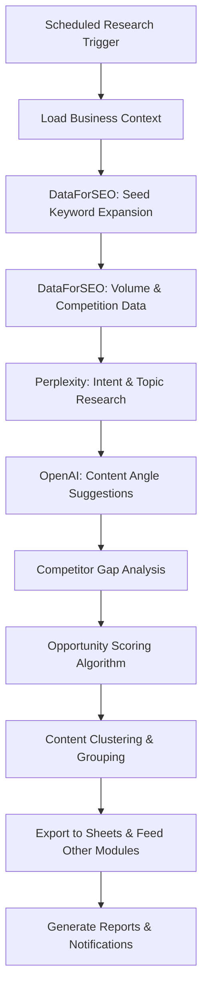

# Keyword Intelligence Module

## 🎯 Purpose

The Keyword Intelligence Module continuously discovers and prioritizes keyword opportunities using DataForSEO MCP, Perplexity MCP, and OpenAI APIs. It finds the ideal balance of search volume, competition levels, and business relevance, delivering actionable keyword insights at defined intervals with detailed competitive analysis and content suggestions.

## 📋 Module Overview

**Category**: SEO & Optimization  
**Complexity**: High  
**Dependencies**: DataForSEO MCP, Perplexity MCP, OpenAI API, Business Brain Builder  
**User Level**: SEO specialists, content strategists, marketers

### What It Does

- **Continuous Keyword Discovery**: Automated research at defined intervals (weekly/biweekly/monthly)
- **Multi-Source Intelligence**: Combines structured data (DataForSEO) with AI research (Perplexity, OpenAI)
- **Competitive Analysis**: Identifies keyword gaps vs. competitors and opportunities
- **Intent Classification**: Categorizes keywords by search intent and funnel stage
- **Opportunity Scoring**: Prioritizes keywords using Volume × Intent Match ÷ Competition formula
- **Content Ideation**: Suggests content angles, topics, and FAQ opportunities
- **Export Integration**: Feeds other modules (Blog Generator, Landing Page Builder)

## 🧙‍♂️ User Experience

### Dashboard Card Display

```
┌─────────────────────────────────┐
│ ┌─────┐               [●]       │
│ │ 🔍  │ Keyword Intelligence     │
│ └─────┘                         │
│                                 │
│ Find ideal keywords with lowest │
│ competition and highest search  │
│ opportunities at set intervals. │
│                                 │
│ ┌─────────────┐ ┌─────────────┐ │
│ │View Report  │ │  Configure  │ │
│ └─────────────┘ └─────────────┘ │
│                                 │
│ Next refresh: Friday            │
│ 47 new opportunities found      │
└─────────────────────────────────┘
```

### Onboarding Wizard Flow

**Step 1: Business Context Setup**
- Import business focus from Business Brain Builder
- Add specific products/services to target
- Define geographic markets and languages
- Set industry-specific terminology

**Step 2: Competitor Intelligence**
- Add 3-5 main competitors (domains)
- Option to auto-discover competitors via AI
- Set competitive analysis depth level
- Choose gap analysis focus areas

**Step 3: Data Source Configuration**
- Configure DataForSEO MCP access and quotas
- Set up Perplexity MCP for research expansion
- Configure OpenAI API for content ideation
- Test all connections and quotas

**Step 4: Research Parameters**
- Set refresh interval (weekly, biweekly, monthly)
- Define keyword limits per cycle (50, 100, 200, 500)
- Choose volume and difficulty thresholds
- Set geographic and language preferences

**Step 5: Scoring & Filtering**
- Configure opportunity scoring weights
- Set minimum/maximum search volumes
- Choose competition level limits
- Define relevance filtering criteria

**Step 6: Output & Integration**
- Select export destinations (Google Sheets, CSV, other modules)
- Configure automated alerts and notifications
- Set up integration with Blog Generator and Landing Page Builder
- Choose report formats and frequencies

## ⚙️ Technical Configuration

### Configuration Schema

```json
{
  "moduleId": "keyword-intelligence",
  "displayName": "Keyword Intelligence",
  "category": "seo-optimization",
  "configurationFields": [
    {
      "id": "business_context",
      "type": "object",
      "label": "Business Context",
      "fields": [
        {
          "id": "primary_services",
          "type": "tags",
          "label": "Primary Services/Products",
          "description": "Main offerings to research keywords for",
          "required": true
        },
        {
          "id": "target_markets",
          "type": "multi-select",
          "label": "Target Geographic Markets",
          "options": ["US", "UK", "CA", "AU", "Global"],
          "default": ["US"]
        },
        {
          "id": "industry_terms",
          "type": "tags",
          "label": "Industry-Specific Terms",
          "description": "Technical terms, jargon, acronyms relevant to your industry"
        }
      ]
    },
    {
      "id": "competitor_analysis",
      "type": "object",
      "label": "Competitive Intelligence",
      "fields": [
        {
          "id": "competitor_domains",
          "type": "array",
          "label": "Competitor Websites",
          "description": "Enter 3-5 main competitor domains",
          "itemType": "url",
          "maxItems": 10
        },
        {
          "id": "auto_discover_competitors",
          "type": "boolean",
          "label": "Auto-discover Additional Competitors",
          "default": true
        },
        {
          "id": "gap_analysis_depth",
          "type": "select",
          "label": "Gap Analysis Depth",
          "options": [
            {"value": "basic", "label": "Basic - Top keywords only"},
            {"value": "comprehensive", "label": "Comprehensive - Deep analysis"},
            {"value": "extensive", "label": "Extensive - Maximum coverage"}
          ],
          "default": "comprehensive"
        }
      ]
    },
    {
      "id": "research_schedule",
      "type": "object",
      "label": "Research Schedule & Limits",
      "fields": [
        {
          "id": "refresh_interval",
          "type": "select",
          "label": "Research Frequency",
          "options": [
            {"value": "weekly", "label": "Weekly - Every Monday"},
            {"value": "biweekly", "label": "Bi-weekly - Every other Monday"},
            {"value": "monthly", "label": "Monthly - First Monday of month"}
          ],
          "default": "weekly"
        },
        {
          "id": "keywords_per_cycle",
          "type": "select",
          "label": "Keywords Per Research Cycle",
          "options": [
            {"value": 50, "label": "50 keywords (Starter)"},
            {"value": 100, "label": "100 keywords (Standard)"},
            {"value": 200, "label": "200 keywords (Professional)"},
            {"value": 500, "label": "500 keywords (Enterprise)"}
          ],
          "default": 200
        }
      ]
    },
    {
      "id": "scoring_criteria",
      "type": "object",
      "label": "Opportunity Scoring",
      "fields": [
        {
          "id": "volume_weight",
          "type": "range",
          "label": "Search Volume Importance",
          "min": 0,
          "max": 10,
          "default": 7,
          "description": "How much to prioritize high search volume"
        },
        {
          "id": "competition_weight",
          "type": "range",
          "label": "Low Competition Importance", 
          "min": 0,
          "max": 10,
          "default": 8,
          "description": "How much to prioritize low competition"
        },
        {
          "id": "intent_match_weight",
          "type": "range",
          "label": "Business Relevance Importance",
          "min": 0,
          "max": 10,
          "default": 9,
          "description": "How much to prioritize business relevance"
        }
      ]
    },
    {
      "id": "output_settings",
      "type": "object",
      "label": "Results & Integration",
      "fields": [
        {
          "id": "export_to_sheets",
          "type": "boolean",
          "label": "Export to Google Sheets",
          "default": true
        },
        {
          "id": "feed_blog_generator",
          "type": "boolean",
          "label": "Send Opportunities to Blog Generator",
          "default": true,
          "description": "Automatically add high-scoring informational keywords to blog pipeline"
        },
        {
          "id": "create_landing_pages",
          "type": "boolean",
          "label": "Suggest Landing Page Opportunities",
          "default": true,
          "description": "Flag commercial keywords for landing page creation"
        }
      ]
    }
  ]
}
```

## 🔍 Research Process Architecture

### Multi-Source Data Collection



### DataForSEO Integration

```javascript
// DataForSEO keyword research workflow
const performKeywordResearch = async (seedKeywords, config) => {
  const dataForSEO = new DataForSEOMCP();
  
  // Step 1: Keyword expansion from seed terms
  const expandedKeywords = await dataForSEO.getKeywordIdeas({
    keywords: seedKeywords,
    location: config.targetMarkets,
    language: config.language,
    search_partners: false,
    date_from: '2024-01-01',
    include_adult_keywords: false,
    sort_by: 'search_volume',
    limit: config.keywordsPerCycle * 2 // Get extra for filtering
  });
  
  // Step 2: Get detailed metrics for expanded keywords
  const keywordMetrics = await dataForSEO.getKeywordMetrics({
    keywords: expandedKeywords.map(k => k.keyword),
    location: config.targetMarkets[0],
    language: config.language
  });
  
  // Step 3: Get SERP features and competition data
  const serpAnalysis = await dataForSEO.getSERPAnalysis({
    keywords: expandedKeywords.slice(0, 100), // Top 100 for detailed analysis
    location: config.targetMarkets[0],
    language: config.language,
    device: 'desktop'
  });
  
  // Step 4: Competitor keyword analysis
  const competitorKeywords = [];
  if (config.competitorDomains?.length > 0) {
    for (const domain of config.competitorDomains) {
      const domainKeywords = await dataForSEO.getDomainKeywords({
        domain: domain,
        location: config.targetMarkets[0],
        limit: 1000
      });
      competitorKeywords.push(...domainKeywords);
    }
  }
  
  return {
    expandedKeywords,
    keywordMetrics,
    serpAnalysis,
    competitorKeywords
  };
};
```

### Perplexity Research Integration

```javascript
// Perplexity MCP for intent and topic research
const enhanceWithPerplexityResearch = async (keywords, businessContext) => {
  const perplexity = new PerplexityMCP();
  const enhancedKeywords = [];
  
  // Group keywords by topic for efficient research
  const topicGroups = clusterKeywordsByTopic(keywords);
  
  for (const group of topicGroups) {
    const research = await perplexity.research({
      query: `What are the main search intents and content types people look for when searching for "${group.primaryKeyword}" in the ${businessContext.industry} industry?`,
      focus: 'search_behavior_analysis',
      sources: ['search_trends', 'industry_reports', 'user_intent_studies']
    });
    
    // Extract insights from Perplexity research
    const intentInsights = extractIntentInsights(research);
    const contentAngles = extractContentAngles(research);
    const relatedQuestions = extractRelatedQuestions(research);
    
    // Enhance each keyword in the group
    for (const keyword of group.keywords) {
      enhancedKeywords.push({
        ...keyword,
        searchIntent: determineSearchIntent(keyword.term, intentInsights),
        contentAngles: suggestContentAngles(keyword.term, contentAngles),
        relatedQuestions: filterRelevantQuestions(keyword.term, relatedQuestions),
        topicCluster: group.primaryKeyword
      });
    }
  }
  
  return enhancedKeywords;
};
```

### OpenAI Content Intelligence

```javascript
// OpenAI integration for content strategy
const generateContentStrategy = async (keywordData, businessBrain) => {
  const openai = new OpenAI();
  
  const prompt = `
    As a content strategist for ${businessBrain.companyName} (${businessBrain.industry}), 
    analyze these keywords and suggest content strategies:
    
    Keywords: ${keywordData.map(k => `${k.term} (${k.volume} searches, ${k.difficulty}% difficulty)`).join(', ')}
    
    Business Context:
    - Services: ${businessBrain.keyServices.join(', ')}
    - Target Audience: ${businessBrain.targetAudience.join(', ')}
    - Competitors: ${businessBrain.competitors?.join(', ') || 'Not specified'}
    
    For each keyword, provide:
    1. Content type recommendation (blog post, landing page, resource page, etc.)
    2. Content angle that differentiates from competitors
    3. Primary call-to-action suggestion
    4. Internal linking opportunities
    5. Content cluster it belongs to
    
    Format as JSON array with detailed strategy for each keyword.
  `;
  
  const response = await openai.chat.completions.create({
    model: 'gpt-4',
    messages: [{ role: 'user', content: prompt }],
    temperature: 0.7,
    max_tokens: 3000
  });
  
  return JSON.parse(response.choices[0].message.content);
};
```

## 📊 Opportunity Scoring Algorithm

### Scoring Formula

The core opportunity score combines multiple factors:

```javascript
// Comprehensive opportunity scoring
const calculateOpportunityScore = (keyword, config, competitorData) => {
  // Base metrics (0-100 scale)
  const volumeScore = normalizeVolume(keyword.searchVolume);
  const competitionScore = 100 - keyword.keywordDifficulty; // Lower difficulty = higher score
  const intentMatchScore = calculateIntentMatch(keyword, config.businessContext);
  
  // Advanced factors
  const serpFeaturesScore = analyzeSERPFeatures(keyword.serpData);
  const competitorGapScore = calculateCompetitorGap(keyword, competitorData);
  const trendScore = analyzeSearchTrend(keyword.trendData);
  const contentGapScore = assessContentGap(keyword);
  
  // Weighted calculation based on user preferences
  const baseScore = (
    (volumeScore * config.volumeWeight) +
    (competitionScore * config.competitionWeight) + 
    (intentMatchScore * config.intentMatchWeight)
  ) / (config.volumeWeight + config.competitionWeight + config.intentMatchWeight);
  
  // Apply multipliers for advanced factors
  const multipliers = {
    serpFeatures: serpFeaturesScore > 70 ? 1.1 : 1.0, // Featured snippet opportunity
    competitorGap: competitorGapScore > 80 ? 1.2 : 1.0, // Major competitor gap
    trend: trendScore > 60 ? 1.05 : (trendScore < 40 ? 0.95 : 1.0), // Trending up/down
    contentGap: contentGapScore > 75 ? 1.15 : 1.0 // Clear content opportunity
  };
  
  const finalScore = baseScore * Object.values(multipliers).reduce((a, b) => a * b, 1);
  
  return Math.min(Math.round(finalScore), 100); // Cap at 100
};

// Helper functions for scoring components
const normalizeVolume = (volume) => {
  if (volume < 100) return 10;
  if (volume < 500) return 25;
  if (volume < 1000) return 40;
  if (volume < 5000) return 60;
  if (volume < 10000) return 80;
  return 100;
};

const calculateIntentMatch = (keyword, businessContext) => {
  // Use NLP to match keyword intent with business services
  const intentScore = analyzeKeywordBusinessRelevance(
    keyword.term,
    businessContext.primaryServices,
    keyword.searchIntent
  );
  
  // Bonus for exact service matches
  const exactMatch = businessContext.primaryServices.some(service => 
    keyword.term.toLowerCase().includes(service.toLowerCase())
  );
  
  return exactMatch ? Math.min(intentScore + 20, 100) : intentScore;
};
```

## 📋 Research Reports & Outputs

### Comprehensive Keyword Report

```javascript
// Generated report structure
const generateKeywordReport = (researchData, config) => {
  return {
    reportMetadata: {
      generatedDate: new Date().toISOString(),
      researchCycle: getCurrentCycle(),
      totalKeywords: researchData.length,
      topOpportunityScore: Math.max(...researchData.map(k => k.opportunityScore))
    },
    
    executiveSummary: {
      topOpportunities: researchData.slice(0, 10),
      competitorGaps: identifyMajorGaps(researchData),
      contentClusters: generateContentClusters(researchData),
      trendingTopics: identifyTrendingTopics(researchData)
    },
    
    detailedAnalysis: {
      bySearchIntent: groupBySearchIntent(researchData),
      byDifficulty: groupByDifficulty(researchData),
      byVolume: groupByVolume(researchData),
      byOpportunityScore: groupByOpportunityScore(researchData)
    },
    
    competitiveIntelligence: {
      gapAnalysis: performGapAnalysis(researchData, config.competitorDomains),
      competitorStrengths: identifyCompetitorStrengths(researchData),
      opportunityAreas: identifyOpportunityAreas(researchData)
    },
    
    actionableInsights: {
      immediateOpportunities: filterImmediate(researchData),
      contentSuggestions: generateContentSuggestions(researchData),
      landingPageOpportunities: identifyLandingPageOpportunities(researchData),
      longTermStrategy: developLongTermStrategy(researchData)
    }
  };
};
```

### Google Sheets Export Format

```javascript
// Structured data export for Google Sheets
const exportToGoogleSheets = async (keywordData, sheetId) => {
  const headers = [
    'Keyword', 'Search Volume', 'Keyword Difficulty', 'Search Intent',
    'Opportunity Score', 'Content Type', 'Priority Level', 'Competitor Gap',
    'SERP Features', 'Content Angle', 'Target Audience', 'Topic Cluster',
    'Internal Link Opportunities', 'Expected Timeline', 'Notes'
  ];
  
  const rows = keywordData.map(keyword => [
    keyword.term,
    keyword.searchVolume,
    keyword.keywordDifficulty,
    keyword.searchIntent,
    keyword.opportunityScore,
    keyword.suggestedContentType,
    keyword.priorityLevel,
    keyword.competitorGap,
    keyword.serpFeatures.join(', '),
    keyword.contentAngle,
    keyword.targetAudience,
    keyword.topicCluster,
    keyword.internalLinkOpportunities.join('; '),
    keyword.expectedTimeline,
    keyword.notes
  ]);
  
  await updateGoogleSheet(sheetId, 'Keywords Research', [headers, ...rows]);
  
  // Create additional sheets for different views
  await createOpportunitiesSheet(sheetId, keywordData);
  await createCompetitorAnalysisSheet(sheetId, keywordData);
  await createContentPlanningSheet(sheetId, keywordData);
};
```

## 🔌 Module Integrations

### Blog Generator Integration

```javascript
// Automatic feeding of blog opportunities
const feedBlogGenerator = async (keywordData) => {
  // Filter for informational keywords suitable for blogs
  const blogKeywords = keywordData.filter(keyword => 
    keyword.searchIntent === 'informational' &&
    keyword.opportunityScore >= 70 &&
    keyword.keywordDifficulty <= 60 &&
    keyword.suggestedContentType.includes('blog')
  );
  
  // Sort by opportunity score
  blogKeywords.sort((a, b) => b.opportunityScore - a.opportunityScore);
  
  // Add to Blog Generator sheet
  for (const keyword of blogKeywords.slice(0, 20)) { // Top 20 opportunities
    await blogGenerator.addKeywordToSheet({
      keyword: keyword.term,
      search_intent: keyword.searchIntent,
      opportunity_score: keyword.opportunityScore,
      content_angle: keyword.contentAngle,
      target_audience: keyword.targetAudience,
      status: 'proposed',
      source: 'keyword-intelligence'
    });
  }
  
  await notifyUser('blog_opportunities_added', {
    count: Math.min(blogKeywords.length, 20),
    topKeywords: blogKeywords.slice(0, 5).map(k => k.term)
  });
};
```

### Landing Page Builder Integration

```javascript
// Commercial keyword opportunities for landing pages
const suggestLandingPages = async (keywordData) => {
  const commercialKeywords = keywordData.filter(keyword =>
    ['commercial', 'transactional'].includes(keyword.searchIntent) &&
    keyword.opportunityScore >= 75 &&
    keyword.competitorGap >= 60
  );
  
  const landingPageOpportunities = commercialKeywords.map(keyword => ({
    targetKeyword: keyword.term,
    searchVolume: keyword.searchVolume,
    competitionLevel: keyword.keywordDifficulty,
    opportunityScore: keyword.opportunityScore,
    suggestedTemplate: determineLandingPageTemplate(keyword),
    primaryCTA: generatePrimaryCTA(keyword),
    expectedConversionRate: estimateConversionRate(keyword),
    priorityLevel: calculatePriorityLevel(keyword)
  }));
  
  await landingPageBuilder.addOpportunities(landingPageOpportunities);
  
  return landingPageOpportunities;
};
```

## 🎯 Success Metrics

### Research Quality Metrics
- **Keyword Acceptance Rate**: % of discovered keywords approved for content creation
- **Opportunity Accuracy**: % of high-scored keywords that actually perform well
- **Competitive Gap Identification**: Number of genuine competitor gaps found

### Content Performance Metrics
- **Ranking Success Rate**: % of targeted keywords achieving top 10 rankings
- **Traffic Impact**: Organic traffic increase from keyword-optimized content
- **Conversion Performance**: Lead generation from keyword-targeted pages

### Operational Efficiency Metrics
- **Research Cycle Completeness**: Successfully completed research cycles
- **API Efficiency**: Optimal use of DataForSEO and other API quotas
- **Time to Content**: Speed from keyword identification to published content

The Keyword Intelligence Module provides the strategic foundation for all SEO and content efforts, ensuring that every piece of content created targets validated, high-opportunity keywords with clear business value.